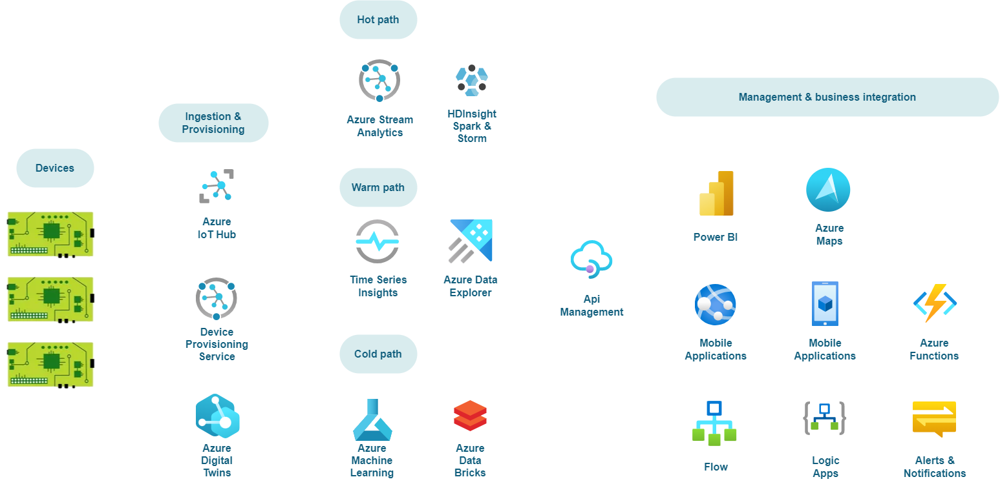
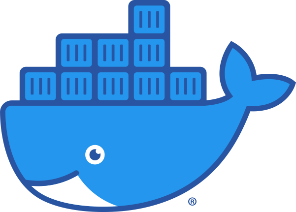
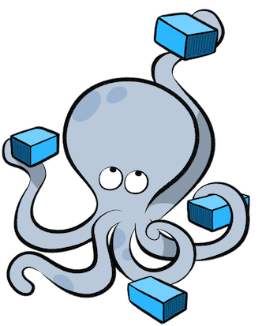

# About EnvironmentMeasurementSystem

ERNI Cross platform IoT show case

<!-- ALL-CONTRIBUTORS-BADGE:START - Do not remove or modify this section -->
<!-- ALL-CONTRIBUTORS-BADGE:END -->

## Getting Started

This is an opensource IoT project to measure Environmental values like polution, noise, temperature, pressure, solar radiation, ...

The project is devided with the following folder structure  

. \
├─ 📁docs: Contains all documentation to related to this project\
│  ├─ 📂[Devices](/docs/Devices/README.md): Contains all the documentation that will be needed to build and develope the devices\
│  ├─ 📂[Digital Twins](/docs/Digital%20Twins/README.md): Contains all the documentation to run/build the digital twins\
│  ├─ 📂[Backend](/docs/Backend/README.md): Contains all the documentation that will be need to develope/deploy the cloud applications/webs\
│  ├─ 📂[UI](/docs/UI/README.md): Contains all the documentation for the UI\
│  └─ 📂[Scripts](/docs/Scripts/README.md): Contains all the documentation for the scripts.\
├─ 📂scripts: Contains all scripts to deploy the application\
├─ 📂src: Contains all the code to run the application\
│  ├─ 📂Devices: Contains all the code that will be deployed to the devices\
│  ├─ 📂Digital Twins: Contains all the code to run the digital twins\
│  ├─ 📂Backend: Contains all the code that will be in the cloud\
│  ├─ 📂UI: Contains all the code for the UI interfaces\
│  │  ├─ 📂 FrontEnd\
│  │  └─ 📂 Mobile\
│  └─ 📂AI/ML: Contains all the code for the AI/ML\
└─ 📂test: Contains all the tests

## Architecture View



## Prerequisites

To run and play with the boilerplates you need to install the followinf ides that you like more:

-  [Visual Studio 2022](https://visualstudio.microsoft.com/)

-  [Visual Studio Code](https://code.visualstudio.com/)

-  [Docker](https://www.docker.com/)
-  [Docker-Compose](https://docs.docker.com/compose/)

## Installation

Installation instructions {{ Name }} by running:

1. Clone the repo

   ```sh
   git clone https://github.com/ERNI-Academy/Project-Name.git
   ```

2. Install packages

    ```sh
    npm install
    ```

3. Configure

    ```JS
    const API_KEY = 'ENTER YOUR API';
    ```

## Contributing

Please see our [Contribution Guide](CONTRIBUTING.md) to learn how to contribute.

## License


(LICENSE) © 2022 [ERNI - Swiss Software Engineering](https://www.betterask.erni)

## Code of conduct

Please see our [Code of Conduct](CODE_OF_CONDUCT.md)

## Stats

<!--Check [https://repobeats.axiom.co/](https://repobeats.axiom.co/) for the right URL-->

## Follow us

[](https://www.twitter.com/ERNI)
[](https://www.twitch.tv/erni_academy)
[](https://www.youtube.com/channel/UCkdDcxjml85-Ydn7Dc577WQ)
[](https://www.linkedin.com/company/erni)

## Contact

📧 [academy@betterask.erni](mailto:academy@betterask.erni)

## Contributors ✨

Thanks goes to these wonderful people ([emoji key](https://allcontributors.org/docs/en/emoji-key)):

<!-- ALL-CONTRIBUTORS-LIST:START - Do not remove or modify this section -->
<!-- ALL-CONTRIBUTORS-LIST:END -->
This project follows the [all-contributors](https://github.com/all-contributors/all-contributors) specification. Contributions of any kind welcome!
