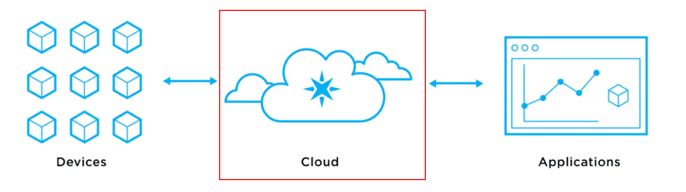

# Backend

## About

## Getting Started

## Architecture View

## Prerequisites

To run and play with the backend project you need to install the following ides/tools that you like more:

* Visual studio
* Visual studio code

## List of all Cloud Services

## How tos
