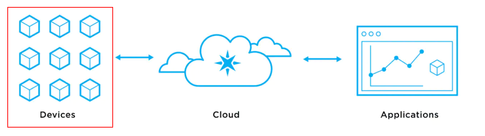
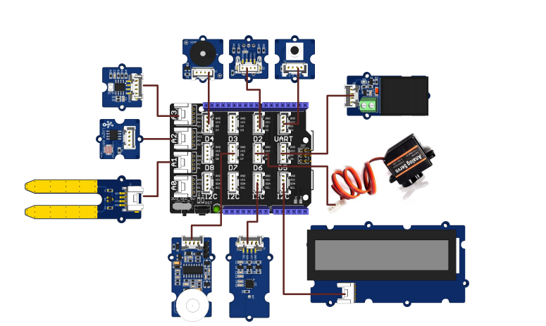

# Devices

## About

This folder contains all the information, BOM, PCB Sketches, and instructions on how to build the devices that will send data from the sensors to the cloud.

## Getting Started

## Architecture View

## Prerequisites

To run and play with the device project you need to install the following ides/tools that you like more:

* Visual studio code

## BOM

Here you can find all the components needed for this project and where to buy them

| Name | Website | Electran Shop | Mouser | AliExpress |
|---|---|---|---|---|
| ADAFRUIT FEATHER M0 WITH RFM95 LORA RADIO - 900MHZ | [3178](https://www.adafruit.com/product/3178) | [Model: ADFC-3178](https://www.electan.com/adafruit-feather-with-rfm95-lora-radio-900mhz-p-8128-en.html) | [De](https://www.mouser.de/ProductDetail/Adafruit/3178?qs=TlVEbN%2FgKDkhUZkXCJivzw%3D%3D) [Es](https://www.mouser.es/ProductDetail/Adafruit/3178?qs=TlVEbN%2FgKDkhUZkXCJivzw%3D%3D) [Ch](https://www.mouser.ch/ProductDetail/Adafruit/3178?qs=sGAEpiMZZMvShe%252BZiYheikdUXzPc1kQj8%252BKcXJsImEM%3D) |---|
| LOLIN D32 V1.0.0 - wifi & bluetooth board based ESP-32 |---|---|---| [32808551116](https://www.aliexpress.com/item/32808551116.html?spm=a2g0o.order_list.0.0.67421802v2Uo76&gatewayAdapt=glo2esp) |
|VERTER 5V USB BUCK-BOOST| [2190](https://www.adafruit.com/product/2190)| [ADFC-2190](https://www.electan.com/verter-usb-buckboost-500ma-from-3v5v-1000ma-from-5v12v-p-7910.html) | [De](https://www.mouser.de/ProductDetail/Adafruit/757?qs=sGAEpiMZZMsKEdP9slC0YZ1HmUQGOJsZgxjTa0NJZ9c%3D) [Es](https://www.mouser.es/ProductDetail/Adafruit/757?qs=GURawfaeGuCFbCY6Rr8Yew%3D%3D) [Ch](https://www.mouser.ch/ProductDetail/Adafruit/757?qs=GURawfaeGuCFbCY6Rr8Yew%3D%3D)|---|
|Bi-Directional Level Shifters|[757](https://www.adafruit.com/product/757)|[I2C-SAFE BI-DIRECTIONAL](https://www.electan.com/4channel-i2csafe-bidirectional-logic-level-converter-p-7500.html)|[De](https://www.mouser.de/ProductDetail/Adafruit/757?qs=sGAEpiMZZMsKEdP9slC0YZ1HmUQGOJsZgxjTa0NJZ9c%3D) [Es](https://www.mouser.es/ProductDetail/Adafruit/757?qs=sGAEpiMZZMsKEdP9slC0YZ1HmUQGOJsZgxjTa0NJZ9c%3D) [Ch](https://www.mouser.ch/ProductDetail/Adafruit/757?qs=sGAEpiMZZMsKEdP9slC0YZ1HmUQGOJsZgxjTa0NJZ9c%3D)|---|
|I2C FRAM|[1895](https://www.adafruit.com/product/1895)| [I2C-FRAM](https://www.electan.com/adafruit-i2c-nonvolatile-fram-breakout-256kbit-32kbyte-p-7820.html)|[De](https://www.mouser.de/ProductDetail/Adafruit/1895?qs=GURawfaeGuCBPwZfYsyy4A%3D%3D) [Es](https://www.mouser.es/ProductDetail/Adafruit/1895?qs=GURawfaeGuCBPwZfYsyy4A%3D%3D) [Ch](https://www.mouser.ch/ProductDetail/Adafruit/1895?qs=GURawfaeGuCBPwZfYsyy4A%3D%3D)|---|
|Temperature / Humidity Sensor|---|---|---|[AM2302 DHT22](https://www.aliexpress.com/item/1005003356193111.html?spm=a2g0o.productlist.0.0.5dc87d51qjpdfr&algo_pvid=bd3ef594-c4a2-4703-a51c-3e91ea12d09d&algo_exp_id=bd3ef594-c4a2-4703-a51c-3e91ea12d09d-11&pdp_ext_f=%7B%22sku_id%22%3A%2212000025374615377%22%7D&pdp_pi=-1&2.38&-1&-1%40salePrice&CHF&search-mainSearch&gatewayAdapt=glo2deu)|
|Nova SDS011 PM Sensor|---|---|---|[SDS011](https://www.aliexpress.com/item/1005003438606341.html?spm=a2g0o.productlist.0.0.167d2033AJN080&algo_pvid=60da14b6-bd62-4f76-8dd2-27dcde18c65a&algo_exp_id=60da14b6-bd62-4f76-8dd2-27dcde18c65a-11&pdp_ext_f=%7B%22sku_id%22%3A%2212000025792888477%22%7D&pdp_pi=-1%3B18.14%3B-1%3B-1%40salePrice%3BCHF%3Bsearch-mainSearch&gatewayAdapt=glo2deu)|
|Lithium Ion Polymer Battery|---|[polymer-batteries 3.7v 2000mAh](https://www.electan.com/lithium-ion-polymer-batteries-p-7268-en.html)|[De](https://www.mouser.de/ProductDetail/Mikroe/MIKROE-4474?qs=CiayqK2gdcJf2TZAjK%2FbSg%3D%3D) [Es](https://www.mouser.es/ProductDetail/Mikroe/MIKROE-4474?qs=CiayqK2gdcJf2TZAjK%2FbSg%3D%3D) [Ch](https://www.mouser.ch/ProductDetail/Mikroe/MIKROE-4474?qs=CiayqK2gdcJf2TZAjK%2FbSg%3D%3D)|---|
|MiCS5524 CO, Alcohol and VOC Gas Sensor Breakout|[3199](https://www.adafruit.com/product/3199)|[mics5524](https://www.electan.com/adafruit-mics5524-alcohol-and-voc-gas-sensor-breakout-p-8135-en.html)|[De](https://www.mouser.de/ProductDetail/Adafruit/3199?qs=A50fv7uxK7UQFHPDHWNmNw%3D%3D) [Es](https://www.mouser.es/ProductDetail/Adafruit/3199?qs=A50fv7uxK7UQFHPDHWNmNw%3D%3D) [Ch](https://www.mouser.ch/ProductDetail/Adafruit/3199?qs=A50fv7uxK7UQFHPDHWNmNw%3D%3D)|[Mics5224](https://www.aliexpress.com/item/33014515301.html?spm=a2g0o.productlist.0.0.4677f9cf6J1NUE&algo_pvid=0731342e-51f9-4d16-911c-2ffce05de19c&algo_exp_id=0731342e-51f9-4d16-911c-2ffce05de19c-0&pdp_ext_f=%7B%22sku_id%22%3A%2267072835366%22%7D&pdp_npi=2%40dis%21CHF%21%214.87%21%21%21%21%21%400bb0622f16526938773281603ec6e9%2167072835366%21sea)|
|Adafruit BMP388 - Precision Barometric Pressure and Altimeter - STEMMA QT|[3966](https://www.adafruit.com/product/3966)|[P-8401](https://www.electan.com/adafruit-p-8401-en.html)|[De](https://www.mouser.de/ProductDetail/Adafruit/3966?qs=byeeYqUIh0NfTW%2FTrOin4A%3D%3D) [Es](https://www.mouser.es/ProductDetail/Adafruit/3966?qs=byeeYqUIh0NfTW%2FTrOin4A%3D%3D) [Ch](https://www.mouser.ch/ProductDetail/Adafruit/3966?qs=byeeYqUIh0NfTW%2FTrOin4A%3D%3D)

## PCB Scketch

Add all pcb scketches and where to buy them

## Supported Networks

* Wifi
* LoraWAN
* Bluetooth LTE
* Zigbee
* Sigfox
* NB-IOT/GSM

## Supported Device Boards

* Arduino Base
* Raspberry PI base
* Bear Metal base

## Components

* ESP8266
* ESP32
* ARM Cortext
* DHT22/MCP9808
* BMP085/180
* MiCS5524
* MiCS2714
* SDS011
* Case
  * IP44
  * IP66

## Sensors

* Temperature
* Humidity
* CO2
* NOx
* PM2.5/10
* Pressure
* Battery Level

## Device Capabilities

1. Power Safe (sleep)
2. Firmware Update (OTA/USB)
3. Security
4. Authentication
5. Provisioning
6. Configuration
   1. Over mobile
   2. Over internal website
   3. Data filtering Rules (time of measurement, deltas, …)
7. Protocols:
   1. MQTT
   2. AMQP
   3. OPC/UA
   4. HTTPS
8. Message Format
   1. Json
   2. Binary
   3. Protobuf

## How to

### Device assembly

Add step by step assembly all components and pcb

### Compile and Deply

Add step by step on how to compile and deploy the software.
